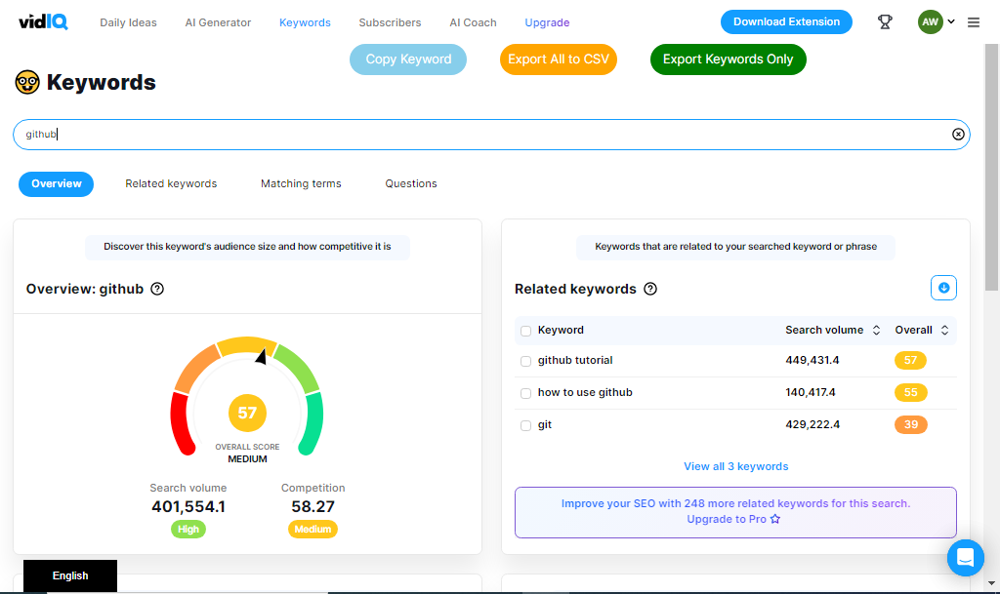

# vidiq-copy-keyword-bulk
Chrome Extension which can copy and export multiple / bulk keywords from vidiq keyword page.

## Screenshot

## Features 
VidIQ free version doesn't support copy multiple keywords and export them to csv. So i have made this extension which can do that job. You just have to search your keyword and click copy button which will be appeared on keyword research page of vidiq after installing this extension. You can search and copy hundreds and thousands of keywords by searching and then hitting copy button and at the end you can also export csv file . 

## How to use
1. Download the zip file of this extension and extract
2. open Google chrome and go to chrome://extentions
3. Turn developer mode on.
4. Click on "Load unpacked" Button
5. Select the foldor you just extracted
6. Extension will be installed

Now goto vidiq keyword research page and start using it for free. If you encounter any issue start pull request or address me that issue. Thanks.

## Donate to this Project
You can support the developer at [Buy me a coffee](https://www.buymeacoffee.com/zubairjammu)

## Disclaimer
This extension is neither an official extension provided by Vidiq nor any connection with Vidiq. We suggest you to buy pro extention of vidiq from their official website
